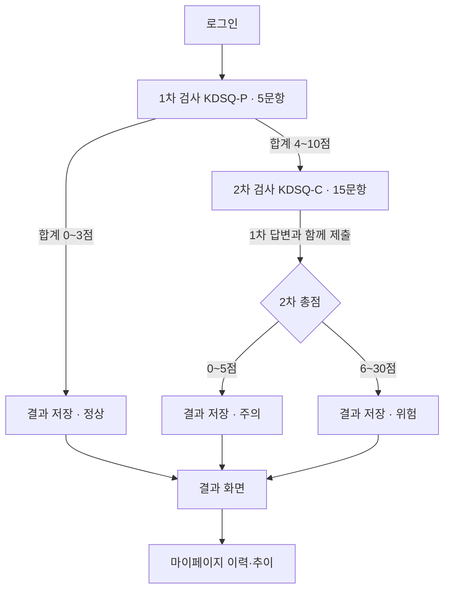
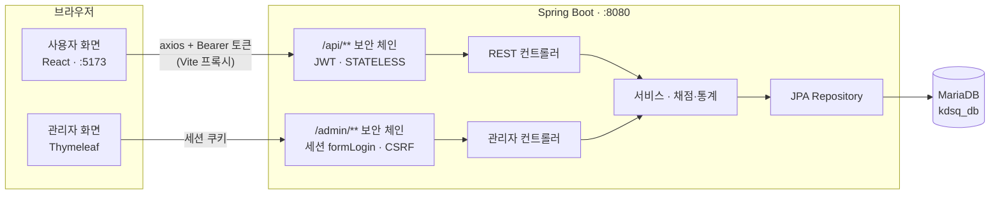
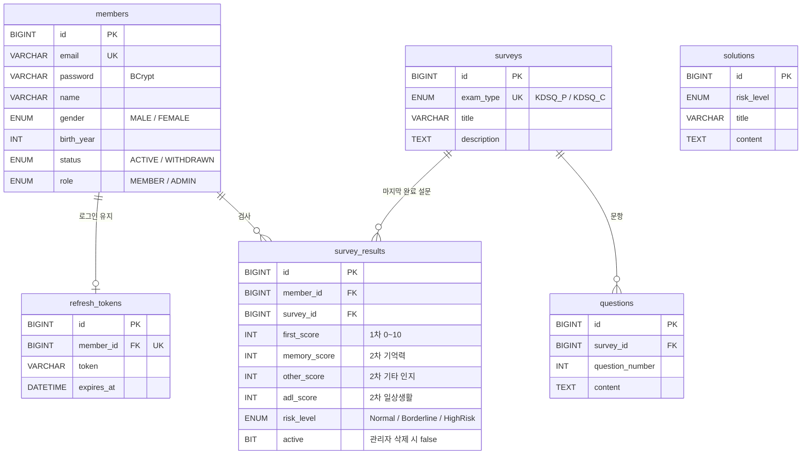

# 마음 기억 — KDSQ 인지선별검사 플랫폼

> 언제 어디서나 한국형 치매선별설문지(KDSQ)로 인지기능을 자가검진하고, 결과와 변화를 한눈에 확인하는 웹 서비스

루키즈 6기 미니 프로젝트 2 · 2조

| 항목 | 내용 |
|---|---|
| 개발 기간 | 2026-09-21 \~ 2026-10-05 (설계 \~9/27, 기능 개발 9/28\~10/1, 안정화·발표 준비 10/2\~10/5) |
| 발표 | 2026-10-06 |
| 팀 | 6명 (백엔드 3, 프론트엔드 3) |
| 저장소 브랜치 | `main`(최종 제출) · `develop`(통합) · `feature/*` · `docs/*` · `test/*` |

---

## 목차

1. [프로젝트 소개](#1-프로젝트-소개)
2. [주요 기능](#2-주요-기능)
3. [검사 흐름과 판정 기준](#3-검사-흐름과-판정-기준)
4. [기술 스택](#4-기술-스택)
5. [시스템 구조](#5-시스템-구조)
6. [ERD](#6-erd)
7. [API 목록](#7-api-목록)
8. [화면 목록](#8-화면-목록)
9. [실행 방법](#9-실행-방법)
10. [테스트](#10-테스트)
11. [프로젝트 구조](#11-프로젝트-구조)
12. [설계 문서](#12-설계-문서)
13. [팀원과 역할](#13-팀원과-역할)
14. [협업 규칙](#14-협업-규칙)

---

## 1. 프로젝트 소개

치매는 조기에 발견할수록 진행을 늦출 수 있지만, 검사를 받으러 기관을 찾는 것부터가 부담입니다. **마음 기억**은 보건소·치매안심센터에서 쓰는 KDSQ 설문을 웹으로 옮겨, 본인이나 가족이 집에서 5분 안에 1차 선별검사를 받고 결과와 변화 추이를 관리할 수 있게 합니다. 관리자는 전체 검사 통계와 위험 판정자를 대시보드에서 확인합니다.

| 목표 | 구현 |
|---|---|
| 누구나 쉽게 검사 | 로그인 후 바로 1차 검사(5문항), 필요할 때만 2차 검사(15문항). 고령층을 고려해 큰 글씨·넓은 선택 영역·모바일 우선 화면 |
| 정확한 채점·판정 | 점수 계산과 판정은 서버가 담당(화면 계산은 이동 판단용). 1·2차를 합쳐 검사 1회당 결과 1건 저장 |
| 결과 관리 | 결과 화면의 영역별 점수와 관리 안내, 마이페이지의 검사 이력 표·점수 추이 그래프 |
| 운영 관리 | 관리자 대시보드(회원 수, 위험도 분포, 평균 점수, 월별 추이, 최근 위험 검사), 회원·검사 결과 검색과 관리 |

> 이 서비스의 결과는 선별검사 결과이며 의학적 진단이 아닙니다. 화면에서도 "진단", "확진" 같은 표현을 쓰지 않습니다 (UI 설계서 3.5.9).

---

## 2. 주요 기능

### 사용자 (React)

| 기능 | 설명 |
|---|---|
| 회원가입·로그인 | 이메일 기반 가입(비밀번호 8\~20자 영문·숫자·특수문자), JWT 로그인. 액세스 토큰 만료 시 자동 재발급 후 요청 재시도 |
| 1차 검사 (KDSQ-P) | 5문항. 0\~3점이면 정상으로 결과 저장, 4점 이상이면 저장하지 않고 2차 검사로 이동 |
| 2차 검사 (KDSQ-C) | 15문항(기억력·기타 인지기능·일상생활 수행능력 각 5문항). 1차 답변과 함께 제출해 결과 1건 저장 |
| 검사 결과 | 판정(정상·주의·위험), 총점과 영역별 점수, 주의·위험일 때 관리 안내 |
| 마이페이지 | 회원 정보(조회 전용), 검사 이력 표, 점수 추이 그래프, 회원 탈퇴 |

### 관리자 (Thymeleaf)

| 기능 | 설명 |
|---|---|
| 관리자 로그인 | 사전 등록된 관리자 계정만 사용 (세션 + CSRF) |
| 대시보드 | 활성·탈퇴 회원 수, 전체 검사 건수, 위험도 분포(건수·%), 종합·영역별 평균, 최근 12개월 추이(Chart.js), 최근 위험 검사 5건 |
| 회원 관리 | 이름·이메일 검색(검색어 강조), 상태 필터, 페이징, 상세(검사 이력), 정보 수정, 탈퇴 처리 |
| 검사 결과 관리 | 이름·기간·검사 종류·판정 복합 검색, 상세 조회, 삭제(소프트 삭제) |

---

## 3. 검사 흐름과 판정 기준



| 판정 | 조건 | 화면 문구 | 관리 안내 |
|---|---|---|---|
| 정상 (Normal) | 1차 0\~3점 | 정상 범위입니다 | 없음 |
| 주의 (Borderline) | 1차 4점 이상 + 2차 총점 0\~5점 | 주의가 필요합니다 | 인지건강 관리 안내 |
| 위험 (HighRisk) | 1차 4점 이상 + 2차 총점 6\~30점 | 전문적인 검진이 필요합니다 | 전문 검진 안내 |

- 선택지 점수: 아니다 0 · 가끔(조금) 그렇다 1 · 자주(많이) 그렇다 2
- 2차 영역: 1\~5번 기억력, 6\~10번 기타 인지기능, 11\~15번 일상생활 수행능력 (영역당 0\~10점)
- 2차 대상자가 중간에 이탈하면 결과를 저장하지 않습니다. 문항별 답변은 저장하지 않고 점수만 저장합니다.

---

## 4. 기술 스택

| 구분 | 기술 |
|---|---|
| 백엔드 | Java 17, Spring Boot 4.0.8, Spring Data JPA (Hibernate 7), Spring Security 7, Bean Validation, Lombok |
| 인증 | JWT (jjwt 0.12.6, HS256) — 액세스 1시간 / 리프레시 7일(DB 저장, 회원당 1개), 관리자는 세션 formLogin |
| 관리자 화면 | Thymeleaf 3.1 + Layout Dialect, Chart.js |
| 데이터베이스 | MariaDB 10.11 |
| 프론트엔드 | React 19, Vite 8, React Router 7, Zustand 5, axios, Tailwind CSS 4, shadcn/ui, Recharts |
| 개발 도구 | MSW(Mock API), JUnit 5 + Mockito + AssertJ, IntelliJ IDEA, VS Code(REST Client), HeidiSQL |
| 협업 | GitHub(PR 리뷰), Discord, Notion, Figma |

---

## 5. 시스템 구조



- **한 서버, 두 인증 방식:** 사용자 API는 JWT(무상태), 관리자 화면은 세션 로그인을 씁니다. `SecurityFilterChain`을 주소별로 나눠(`@Order`) 서로 영향을 주지 않습니다 (REST 설계서 3.3).
- **공통 응답 형식:** 모든 API는 `{ success, data, message, timestamp }`, 오류는 `{ success: false, error: { code, message, fields } }`로 응답하고, 화면은 HTTP 상태가 아니라 `error.code`로 분기합니다 (REST 설계서 2.5·5장).
- **개발 중 Mock:** 백엔드 없이도 프론트를 개발할 수 있도록 MSW가 설계서와 같은 응답을 돌려줍니다. 목요일 통합 때 환경 변수 하나로 실제 서버에 연결합니다.

---

## 6. ERD



- 모든 테이블에 `created_at`, `updated_at`(JPA Auditing)이 있습니다.
- `solutions`는 결과와 외래키로 연결하지 않고 **판정 등급(risk_level)이 같은 안내**를 조회합니다.
- 총점과 검사 종류는 저장하지 않고 계산합니다 (`memory + other + adl`, 연결된 설문의 `exam_type`).
- 회원 탈퇴와 결과 삭제는 모두 **소프트 삭제**입니다(상태값 변경). 탈퇴해도 검사 결과는 통계를 위해 보존합니다.

---

## 7. API 목록

사용자 화면(React)이 호출하는 REST API입니다. 관리자 기능은 Thymeleaf 화면(`/admin/**`)으로 제공해 REST API가 없습니다.

| 기능 | 메서드 | URL | 인증 | 성공 |
|---|---|---|---|---|
| 회원가입 | POST | `/api/members` | - | 201 |
| 로그인 | POST | `/api/auth/login` | - | 200 |
| 토큰 재발급 | POST | `/api/auth/reissue` | - | 200 |
| 로그아웃 | POST | `/api/auth/logout` | JWT | 204 |
| 내 정보 조회 | GET | `/api/members/me` | JWT | 200 |
| 회원 탈퇴 | DELETE | `/api/members/me` | JWT | 204 |
| 설문 목록 | GET | `/api/surveys?examType=` | JWT | 200 |
| 문항 조회 | GET | `/api/surveys/{surveyId}/questions` | JWT | 200 |
| 검사 결과 제출 | POST | `/api/results` | JWT | 201 |
| 검사 결과 상세 | GET | `/api/results/{resultId}` | JWT (본인) | 200 |
| 내 검사 이력 | GET | `/api/members/me/results?page=&size=` | JWT | 200 |
| 서버 상태 확인 | GET | `/api/health` | - | 200 |

주요 오류 코드: `VALIDATION_ERROR`(400), `INVALID_CREDENTIALS`·`ACCESS_TOKEN_EXPIRED`·`INVALID_REFRESH_TOKEN`·`UNAUTHORIZED`(401), `MEMBER_WITHDRAWN`(403), `RESULT_NOT_FOUND`(404, 다른 회원의 결과도 404), `DUPLICATE_EMAIL`(409), `KDSQ_C_REQUIRED`·`KDSQ_C_NOT_ALLOWED`(422)
요청·응답 예시와 전체 오류 코드는 [REST API 설계서](필수제출문서/3.RESTAPI설계서_2조.md)에 있습니다.

---

## 8. 화면 목록

| 사용자 화면 | URL | | 관리자 화면 | URL |
|---|---|---|---|---|
| SCR-01 로그인 | `/login` | | ADM-01 관리자 로그인 | `/admin/login` |
| SCR-02 회원가입 | `/register` | | ADM-02 대시보드 | `/admin/dashboard` |
| SCR-03 1차 검사 | `/surveys/p` | | ADM-03 회원 관리 | `/admin/members` |
| SCR-04 2차 검사 | `/surveys/c` | | ADM-04 회원 상세 · 04-1 수정 | `/admin/members/{id}`, `/edit` |
| SCR-05 검사 결과 | `/results/:resultId` | | ADM-05 검사 결과 | `/admin/results` |
| SCR-06 마이페이지 | `/mypage` | | ADM-06 검사 상세 결과 | `/admin/results/{id}` |

<!-- 기능 개발 마감(10/1) 후 실제 화면 캡처를 docs/images/에 넣고 아래 표를 채웁니다.
| 1차 검사 | 검사 결과 | 마이페이지 | 관리자 대시보드 |
|---|---|---|---|
|  |  |  |  |
-->

와이어프레임과 화면별 상태·문구는 [UI 화면설계서](필수제출문서/4.UI화면설계서_2조.md)에 있습니다.

---

## 9. 실행 방법

### 준비물

| 프로그램 | 버전 |
|---|---|
| JDK | 17 |
| MariaDB | 10.11 |
| Node.js | 20.19 이상 또는 22.12 이상 (22 LTS 권장) |

### 1) 코드 받기

```bash
git clone https://github.com/ekdud01/Mini_Project_2.git
cd Mini_Project_2
git checkout develop        # 10/5 이후에는 main
```

### 2) DB 만들기

```sql
CREATE DATABASE kdsq_db DEFAULT CHARACTER SET utf8mb4 COLLATE utf8mb4_unicode_ci;
```

테이블은 서버를 처음 실행할 때 자동으로 만들어지고, 설문·문항·관리 안내 초기 데이터와 관리자 계정도 자동으로 등록됩니다. DB 계정 설정은 [backend/README.md 2-2\~2-3](backend/README.md)을 따릅니다. 개인 DB 비밀번호는 `application-local.properties`(Git 제외)에만 적습니다.

### 3) 백엔드 실행 — http://localhost:8080

```bash
cd backend
./gradlew bootRun            # Windows 명령 프롬프트: gradlew.bat bootRun
```

- 확인: http://localhost:8080/api/health → `"status":"UP"`
- 관리자 화면: http://localhost:8080/admin/login (개발용 관리자 계정은 [backend/README.md 3-2](backend/README.md))
- 대시보드·목록 확인용 샘플 데이터(회원 26명, 검사 결과 119건): `backend/http/sample-data.sql`

### 4) 프론트엔드 실행 — http://localhost:5173

```bash
cd frontend
npm install
npm run dev
```

- 기본은 **Mock 모드**라 백엔드 없이 동작합니다. 테스트 계정은 [mock-data/README.md](mock-data/README.md)를 참고합니다.
- 실제 백엔드에 연결하려면 `frontend/.env.development.local`에 `VITE_USE_MOCK=false`를 넣고 다시 실행합니다. `/api` 요청이 Vite 프록시를 거쳐 8080으로 갑니다.

자세한 세팅과 문제 해결은 각 폴더의 README에 있습니다: [backend](backend/README.md) · [frontend](frontend/README.md) · [mock-data](mock-data/README.md)

---

## 10. 테스트

```bash
cd backend
./gradlew test
```

DB·서버 없이 실행되는 단위 테스트입니다. Repository 등 의존 객체는 Mockito로 대체하고, 각 테스트 이름(`@DisplayName`)에 확인하는 규칙을 한글로 적었습니다.

| 테스트 | 확인 내용 |
|---|---|
| `MemberServiceTest` | 회원가입(비밀번호 암호화, 이메일 중복 409), 내 정보, 탈퇴(소프트 삭제·토큰 폐기) |
| `AuthServiceTest` | 로그인 성공·실패(401·403), 관리자 계정 차단, 토큰 재발급 실패 5가지, 로그아웃 |
| `JwtTokenProviderTest` | 토큰 발급·검증, 만료·위조·변조 토큰, 짧은 비밀키 |
| `SignupRequestValidationTest` | 회원가입 입력 규칙과 오류 문구 (비밀번호 규칙 위반 7가지 등) |
| `AdminStatisticsServiceTest` | 대시보드 위험도 비율(%)·반올림, 빈 등급·빈 달 처리 |
| `AdminMemberServiceTest` | 관리자 회원 조회·수정·탈퇴 처리 규칙 |

API 단위 시나리오는 REST 설계서 7.4의 테스트 케이스(TC-AUTH·TC-SURV·TC-RES)를 `backend/http/*.http`로 확인합니다.
프론트엔드 인증 흐름(토큰 재발급·동시 요청) 테스트: `cd frontend && npm run test:auth`

---

## 11. 프로젝트 구조

```text
Mini_Project_2/
├── backend/                     Spring Boot (REST API + 관리자 화면)
│   ├── src/main/java/com/kdsq/
│   │   ├── auth/                로그인·토큰 재발급·로그아웃, RefreshToken
│   │   ├── member/              회원가입·내 정보·탈퇴, Member
│   │   ├── survey/              설문·문항 조회
│   │   ├── result/              결과 제출·채점(ScoringService)·상세·이력
│   │   ├── admin/               관리자 대시보드·회원·검사 결과 관리
│   │   └── global/              보안(SecurityConfig·JWT), 공통 응답, 예외 처리, 검증
│   ├── src/main/resources/
│   │   ├── templates/           관리자 화면 (Thymeleaf)
│   │   └── data.sql             설문·문항·관리 안내 초기 데이터
│   ├── src/test/                단위 테스트
│   └── http/                    API 테스트(.http), 샘플 데이터 SQL
├── frontend/                    React 사용자 화면
│   └── src/
│       ├── api/                 axios 인스턴스(토큰·재발급 인터셉터), API 함수
│       ├── store/               Zustand (auth·survey·result·member)
│       ├── pages/               Login·Register·Survey·Result·MyPage
│       └── components/          공통·레이아웃·shadcn ui
├── mock-data/                   Mock 응답 JSON, MSW 핸들러, 테스트 계정
├── 필수제출문서/                 설계서 5종
└── docs/                        개발 파트 분배·일정·규칙
```

---

## 12. 설계 문서

| 문서 | 내용 |
|---|---|
| [1. 도메인 설계서](필수제출문서/1.도메인설계서_2조.md) | 요구사항, 비즈니스 규칙, 도메인 모델(UML), 용어 정의 |
| [2. Entity 설계서](필수제출문서/2.Entity설계서_2조.md) | 엔티티·연관관계, 채점 서비스, 조회 쿼리·N+1 대응, 테이블 정의서 |
| [3. REST API 설계서](필수제출문서/3.RESTAPI설계서_2조.md) | API 명세, JWT·보안 체인, 오류 코드, 테스트 케이스 |
| [4. UI 화면설계서](필수제출문서/4.UI화면설계서_2조.md) | 사용자·관리자 화면 와이어프레임, 상태·문구, 반응형·접근성 |
| [5. React 컴포넌트 설계서](필수제출문서/5.React컴포넌트와Props_State설계서_2조.md) | 컴포넌트 트리, Props·State, 스토어, API 연동, 오류 처리 |
| [개발 파트 분배](docs/개발_파트_분배.md) | 담당, 일정, 화면 연결 규칙, Git 규칙 |

---

## 13. 팀원과 역할

| 이름 | 파트 | 담당 |
|---|---|---|
| 윤수연 (팀장) | 백엔드 | 회원 API, 인증(JWT·Spring Security 보안 체인), 관리자 공통(예외 처리·Model), 관리자 대시보드 통계, 백엔드 PR 리뷰 |
| 이주혁 | 백엔드 | 설문·문항 조회, 결과 제출·채점, 결과 상세, 내 검사 이력, Repository·초기 데이터 |
| 이원구 | 백엔드 | 관리자 회원 관리, 관리자 검사 결과 관리(복합 검색) |
| 강찬식 | 프론트엔드 | 인증 흐름(axios 인터셉터·authStore·Header), 로그인·회원가입·마이페이지, 프론트 PR 리뷰 |
| 서다영 | 프론트엔드 | 1차·2차 검사, 검사 결과 화면 |
| 황지영 | 프론트엔드 | 관리자 화면 Thymeleaf 템플릿(레이아웃, 7개 화면, 차트, 에러 페이지) |

---

## 14. 협업 규칙

**브랜치 전략**

```text
main ← develop ← feature/be-*, feature/fe-*   (기능)
                ← docs/*                       (설계서·문서)
                ← test/*                       (테스트)
```

- `main`, `develop`에는 직접 커밋하지 않고 PR로만 병합합니다. `main`은 최종 제출 시 한 번 병합합니다.
- PR 검토·병합: 백엔드 윤수연, 프론트엔드 강찬식. 병합한 브랜치는 작업 기록으로 남겨 둡니다.
- 설계서의 최신본은 `develop` 기준이며, 기능 브랜치에서는 설계서를 고치지 않습니다.

**커밋 메시지:** `타입: 요약` — `feat`, `fix`, `refactor`, `test`, `docs`, `style`, `chore`

**코드·문구 규칙**

- 설계서를 먼저 고치고 코드를 맞춥니다. 코드와 설계서가 다르면 팀에서 정한 뒤 둘 다 고칩니다.
- 화면에 보이는 문구는 끝에 마침표를 찍지 않고, 같은 상황에는 서버와 화면이 같은 문구를 씁니다 (UI 설계서 2.4).
- 개인 설정 파일(`application-local.properties`, `.env.development.local`)은 커밋하지 않습니다.
