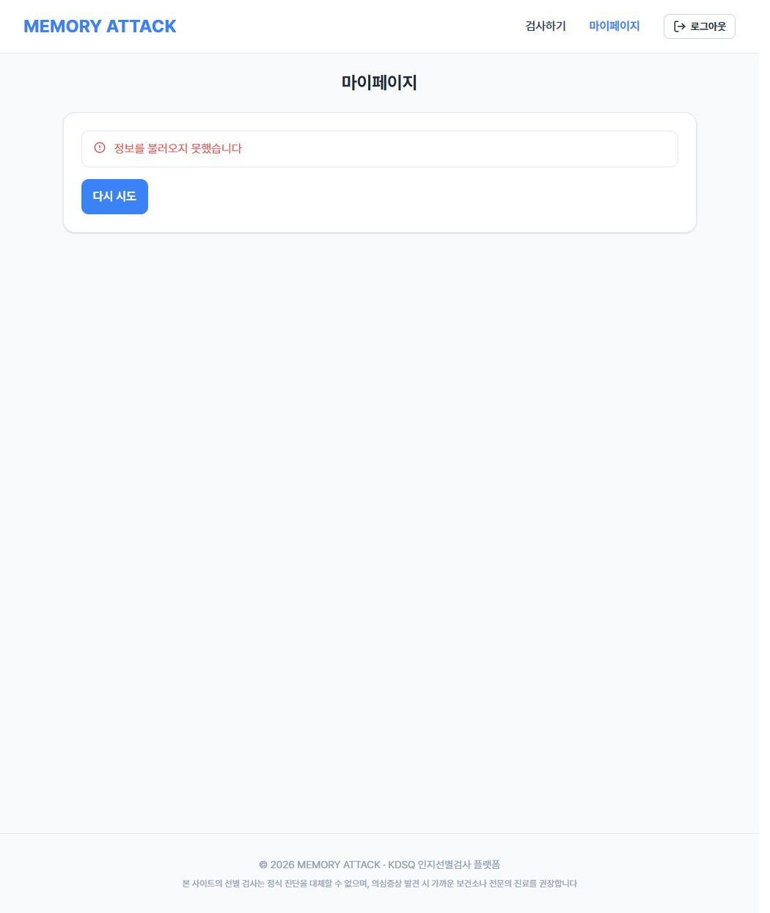
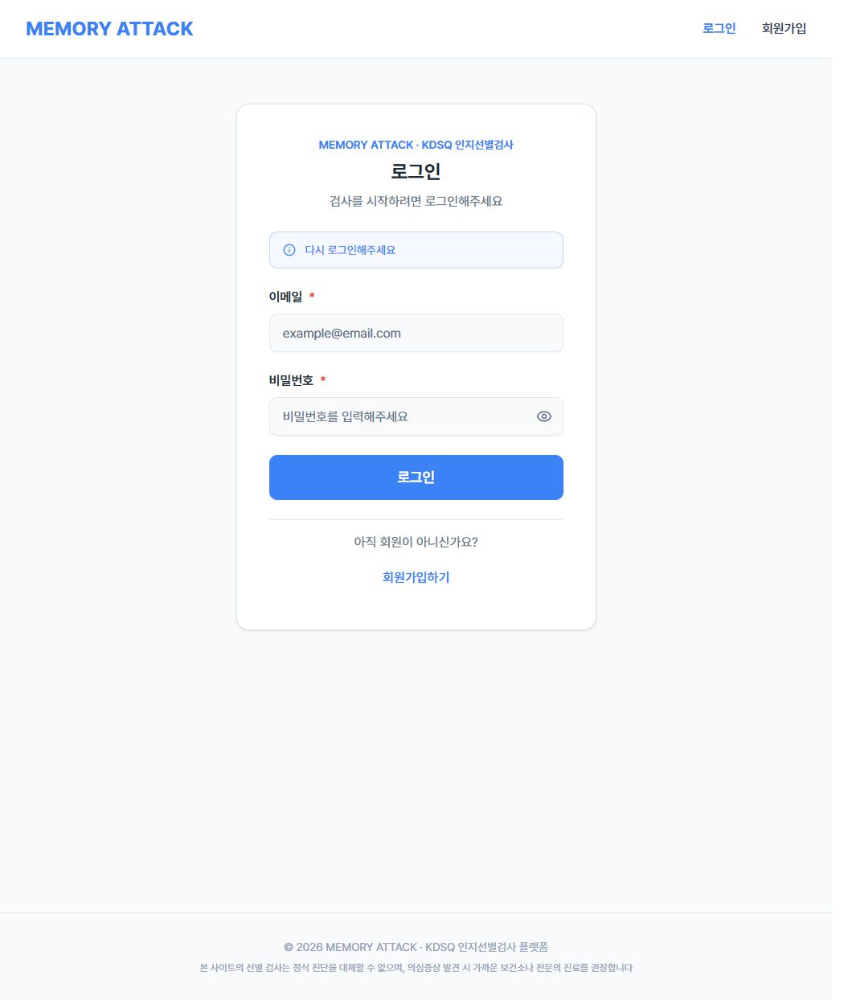

# I-08 실제 JWT·MariaDB·브라우저 재검증

2026-10-06 약 04:35~04:42 KST. 사용자 요청에 따라 Codex가 실행했다.

## 결론

관리자 비활성화 이후에도 JWT 자체는 만료 전일 수 있지만, 회원 정보·결과 서비스의 활성 상태 검사에서 접근을 차단한다. 기존 체크리스트의 “만료 전 결과 조회 가능” 설명은 현재 구현과 달라 정정했다. 정정한 I-08 기대값은 실제 API와 브라우저에서 충족했다.

만료 전에는 MyPage 오류·재시도 화면에 남고, 만료 후 재발급도 실패하면 로그인 화면으로 이동한다. 외부 비활성화 시 즉시 로그인 이동이나 별도의 계정 이용 불가 안내는 구현되지 않은 UX 개선 후보이며, API 조회 차단 실패와는 구분한다.

## 환경

| 항목 | 실행 조건 |
|---|---|
| 기준 코드 | develop / bcb9dc1dd7ad008bd3a5e1158859496a6ab46d10 |
| 제품 코드 변경 | 없음 |
| 백엔드 | Java 17.0.19, Spring Boot 4.0.8, localhost:8080, Gradle offline bootRun |
| DB | MariaDB 12.3.3, 별도 프로세스 127.0.0.1:3318, kdsq_i08 |
| 프론트 | 현재 checkout, Vite 8.3.1, 127.0.0.1:5173, VITE_USE_MOCK=false |
| 브라우저 | Codex 내장 브라우저. 실제 로그인 폼으로 로그인하고 화면 이동·새로고침·재시도 조작 |
| API 클라이언트 | Python requests 2.32.3, 실제 HTTP. Mock·응답 가로채기·토큰 위조 없음 |
| 기본 만료 조건 | access token 3600초. JWT iat/exp로 확인 |
| 가속 만료 조건 | 두 번째 서버 프로세스에 APP_JWT_ACCESS_TOKEN_VALIDITY_SECONDS=60. 새 JWT iat/exp가 60초임을 확인한 뒤 자연 만료 대기 |
| 데이터 | 신규 테스트 회원 2명, 각 KDSQ-P 0점 결과 1건. API와 브라우저 계정을 분리해 로그인 시 refresh token 교체가 API 검증을 오염시키지 않도록 함 |

기존 MariaDB 3307의 계정은 boot_db에만 권한이 있어 별도 임시 인스턴스를 사용했다. 기존 DB, 권한, 공용 application.properties와 프론트 환경 파일은 변경하지 않았다. 이번 임시 DB에는 기본 설문·문항·안내와 자동 초기화 관리자, 신규 검증 회원만 있다. 기존 샘플 26명·119건으로 실행한 테스트가 아니다.

## 실행 결과

| 조건 | API 관찰 | 브라우저 관찰 | 판정 |
|---|---|---|---|
| 활성 상태 | 회원가입·결과 저장 201, 로그인·내 정보·결과 상세·이력 200 | 검증 회원 이름, 결과 1건과 차트 표시 | 통과 |
| 관리자 비활성화 + 만료 전 토큰 | 내 정보·상세·이력·정상 형식 제출 모두 404 MEMBER_NOT_FOUND | MyPage 새로고침 후 “정보를 불러오지 못했습니다”, “다시 시도”, 로그인 상태의 메뉴 표시 | 통과 |
| 만료 전 화면 재시도 | API 검증과 별도로 브라우저 재시도 수행 | 같은 오류 화면 유지, 로그인으로 이동하지 않음 | 통과 |
| 비활성 회원 재발급·로그인 | 재발급 401 INVALID_REFRESH_TOKEN, 올바른 자격정보 로그인 403 MEMBER_WITHDRAWN | 해당 API는 Python에서 직접 확인 | 통과 |
| 60초 토큰 만료 후 | 내 정보·상세·이력·제출 401 ACCESS_TOKEN_EXPIRED, 재발급 401 INVALID_REFRESH_TOKEN | 기존 로그인 세션에서 MyPage 진입 → /login, “다시 로그인해주세요” | 통과 |
| DB 후속 확인 | 회원 id 2·3 WITHDRAWN, 결과는 각 1건 보존, refresh token 0건 | SQL 읽기 전용 조회 | 통과 |

API 기록에는 정상 준비 과정과 반복 조건을 포함한 HTTP 상태·오류 코드 assertion 33회, 관리자 상태 변경 6회, JWT 수명 기록 3회, 만료 조건 확인 3회가 있다. 모두 일치했다. 이것을 서로 다른 제품 테스트 45개로 집계하지 않는다. 원래 119개 체크리스트에 더해 테스트 총수를 부풀리지 않는다.

## 증거

- [API 상태·오류 코드·시각·만료 조건 JSON](api-results.json): 원문 토큰·비밀번호 미포함. 시각은 UTC
- [재실행 스크립트](../../../backend/http/i08_reverify.py): 실제 사용자 API와 관리자 로그인·CSRF POST 사용
- [만료 후 화면 접근성 트리](expired-login-ax.txt)

### 만료 전 비활성 회원의 MyPage

### 만료 후 로그인 이동

## 재현 순서

이 스크립트는 별도 임시 DB를 연결한 로컬 테스트 서버 전용이다. 공유·운영 DB에서 실행하지 않는다. 제품 API로 가입한 검증 회원만 관리자 기능으로 상태를 변경한다.

1. 별도 MariaDB 인스턴스와 새 DB를 준비하고 현재 backend를 연결한다. 기존 DB를 재사용하거나 덮어쓰지 않는다.
2. frontend에 프로세스 환경 변수 VITE_USE_MOCK=false를 주고 기동한다. 실제 API 결과와 DB 저장으로 실서버 연결을 확인한다.
3. I08_STATE는 Git 밖 임시 파일 경로, I08_REPORT는 결과 JSON 경로, I08_ADMIN_PASSWORD는 해당 임시 서버 관리자 비밀번호로 설정한다. 상태 파일에는 토큰이 있으므로 출력하거나 커밋하지 않는다.
4. `python -X utf8 backend/http/i08_reverify.py prepare`로 API용·브라우저용 계정과 정상 결과를 만든다. 스크립트의 테스트 비밀번호로 브라우저 계정에 로그인해 MyPage 1건을 확인한다.
5. `deactivate`를 실행한다. 관리자 폼 로그인과 CSRF를 거쳐 비활성화하고, API용 계정의 기존 만료 전 JWT로 차단을 확인한다. 브라우저 MyPage 새로고침·재시도를 관찰한다.
6. `reactivate`로 테스트 계정만 다시 활성화한다. 기존 브라우저 세션은 로그아웃한다.
7. 백엔드를 같은 임시 DB에 연결해 재기동하되 프로세스에만 APP_JWT_ACCESS_TOKEN_VALIDITY_SECONDS=60을 적용한다. 브라우저를 다시 로그인하고 `short-login`, `deactivate`를 60초 이내에 실행한다.
8. JWT exp 이후 `expired`를 실행한다. 브라우저에서도 새 요청을 보내 로그인 이동을 확인한다.
9. DB의 회원 상태·결과 보존·토큰 삭제를 확인한다. 증거를 저장하고 실행한 서버와 임시 DB·토큰 상태 파일을 정리한다.

## 검증 범위와 한계

- 코드 조회·Mock 단위 테스트만으로 판단한 결과가 아니라 실제 Spring 서버·JWT·MariaDB·브라우저를 사용한 I-08 확인이다.
- 만료 후 조건은 같은 코드의 수명을 60초로 줄인 실험이다. 운영 기본 3600초를 끝까지 기다린 검증으로 표현하지 않는다.
- 브라우저에서는 화면 결과를 관찰했으며, 전체 HTTP 네트워크 HAR는 수집하지 않았다. HTTP 상태·오류 코드는 별도 API 계정의 requests 기록으로 보존했다.
- 같은 창에서 직접 탈퇴하는 U-40~U-44, 비활성 결과의 상세 화면 UI, 전체 119항목, 운영 배포 환경, 모든 동시성 조건은 이번에 재실행하지 않았다.
- 처음 열린 브라우저에는 이전 세션의 인증 실패 안내·로그가 있었으며 테스트용 계정으로 새로 로그인한 이후를 본 검증의 기준으로 삼았다.
- 이 결과는 검사 안내의 임상 타당성이나 접근성 전체 적합성을 평가하지 않는다.

## 종료·정리

검증용 백엔드·프론트·MariaDB 프로세스를 종료하고 8080·5173·3318 포트가 닫혔음을 확인했다. 정확한 임시 폴더 경로를 확인한 뒤 테스트 DB와 토큰 상태 파일을 삭제했다. 기존 MariaDB 3307 프로세스는 계속 실행 중이며 변경하지 않았다. 증거 JSON·화면 캡처·재현 스크립트·문서만 저장소에 남겼다. 제품 코드 수정, 커밋, 푸시, PR 병합은 수행하지 않았다.
