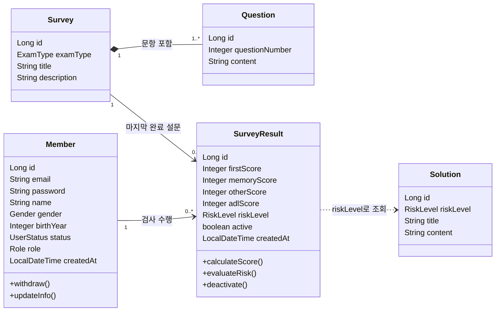

# 도메인 설계서

## 문서 정보

| 항목 | 내용 |
|------|------|
| **프로젝트명** | KDSQ 인지선별검사 플랫폼 (KDSQ Cognitive Screening Platform) |
| **작성자** | 윤수연 |
| **작성일** | 2026-09-24 |
| **버전** | v2.7 |

### 변경 이력

| 버전 | 일자 | 내용 |
|------|------|------|
| v2.1 | 2026-09-24 | 설문(surveys)/결과(results) 도메인 분리(대안 B), ExamResult → SurveyResult, 검사 1회당 결과 1건 저장, 판정 기준 통일 |
| v2.2 | 2026-09-24 | 회원정보는 가입 후 본인 수정 불가(관리자만 수정), 본인 탈퇴 허용 명시 |
| v2.3 | 2026-09-25 | Member에 권한(role)·가입일(createdAt) 속성 추가, 관리자 계정 규칙, 관리자 탈퇴 처리, 대시보드 최근 위험 목록 |
| v2.4 | 2026-09-25 | SurveyResult에 active(소프트 삭제) 속성·deactivate() 추가, HighRisk 표시명을 '위험'으로 통일 |
| v2.5 | 2026-09-25 | 평가 기준 반영: UML 클래스 다이어그램(4.2) 추가, 용어 정의(7장) 추가 |
| v2.6 | 2026-09-25 | 용어 정의에 KDSQ-C 정식 명칭(KDSQ-cognition)과 검사 안내 문구(1년 전과 비교, 가족 작성 우선) 반영 |
| v2.7 | 2026-09-25 | 답변 선택지 문구를 KDSQ 원문 표기(아니다 / 가끔(조금) 그렇다 / 자주(많이) 그렇다)로 통일 |

---

## 1. 프로젝트 개요

### 1.1 프로젝트 목적

사용자가 언제 어디서나 간편하게 KDSQ(한국형 치매선별설문지) 기반의 인지기능 자가검진을 진행할 수 있도록 하고, 검사 결과 데이터 조회 및 판정 과정을 디지털화하여 치매 조기 진단 및 관리의 효율성을 높인다.

### 1.2 프로젝트 범위

**포함 범위:**
- 회원 관리 — 일반 이메일 기반 가입, 로그인(JWT), 환자 정보(환자명/출생년도/연령/성별) 관리  
- 설문 및 검사 관리 — KDSQ-P(5문항, 1차 검사) 및 KDSQ-C(15문항, 2차 상세 검사) 문항 데이터 및 응시 관리  
- 검사 결과 및 통계 관리 — 점수 자동 산출, 정상/주의/위험 분류, 과거 검사이력 결과 조회  
- 맞춤 솔루션 제공 — 검사 결과 주의, 위험 판정 시 유용한 정보 및 솔루션 안내

**제외 범위:**
- 결제 시스템  
- 실시간 알림 (이메일 알림 등)  
- 병원 연계 예약 시스템
- 검사 중간 이탈자 데이터 저장 및 이탈률 통계

### 1.3 주요 이해관계자

| 구분 | 역할 | 주요 관심사 |
|------|------|-------------|
| **일반 사용자 (검사 대상)** | 시스템 사용자 | 인지검사 응시, 검사결과 조회, 검사이력 조회 |
| **사이트 관리자 (Admin)** | 사이트 관리자 | 대시보드, 회원 관리, 검사결과 조회 |
| **IT 담당자** | 시스템 관리자 | 서버 운영, 보안, 백업, 확장성 |

---

## 2. 비즈니스 도메인 분석

### 2.1 핵심 비즈니스 프로세스

#### 2.1.1 인지선별검사 및 결과 판정 프로세스
```
[사용자] 로그인 후 KDSQ-P (5문항) 검사 응시            ← [surveys] 문항 조회
    ↓
[시스템] 1차 점수 확인 (4점 기준 분기)
├─ [0 ~ 3점]  → [results] 채점·정상 판정, 결과 1건 저장 및 통계 반영
└─ [4 ~ 10점] → 결과를 저장하지 않고 KDSQ-C (15문항) 추가 상세 검사 진행
    ↓                                                   ← [surveys] 문항 조회
[사용자] KDSQ-C 15문항 응답 후 1차·2차 답변을 함께 제출
    ↓
[시스템] [results] 1차 답변 재채점·검증, 15문항 영역별 점수 산출 및 판정 기준 적용
├─ [0 ~ 5점]  → 주의
└─ [6 ~ 30점] → 위험
    ↓
[시스템] [results] 1·2차 점수를 결과 1건 저장 및 맞춤 솔루션(정보) 제공
```

**비즈니스 규칙:**
- KDSQ-P(5문항) 점수 4\~10점 → KDSQ-C(15문항) 추가 검사 진행
- KDSQ-C(15문항): 점수 0\~5점 (주의), 6\~30점 (위험)
- 검사 1회당 결과는 1건만 저장한다. KDSQ-P 4점 이상인 사용자는 KDSQ-C까지 완료했을 때 1·2차 점수를 함께 저장한다.
- 2차 대상자가 KDSQ-C를 완료하지 않고 이탈하면 결과를 저장하지 않는다.
- 최종 채점과 판정은 서버(결과 도메인)가 수행한다. 화면의 1차 합계는 2차 검사 진행 여부를 판단하는 데만 사용한다.
- 검사 결과는 사용자 계정에 영구 저장되어 마이페이지에서 확인 가능
- 현재 검사 결과를 기반으로 자신의 종합, 세부 영역별 인지능력 확인 가능

#### 2.1.2 회원 가입 / 로그인 프로세스
```
[사용자] 이메일 + 비밀번호 + 환자 인적정보 입력
    ↓
[시스템] 이메일 중복 확인 → 비밀번호 BCrypt 암호화
    ↓
[사용자] 로그인 → JWT 액세스 토큰 + 리프레시 토큰 발급
```

### 2.2 비즈니스 이벤트

| 이벤트 | 트리거 | 결과 |
|--------|--------|------|
| **회원 가입** | 정보 입력 후 가입 버튼 | Member 레코드 생성, 비밀번호 암호화 저장 |
| **로그인 성공** | 이메일/비밀번호 일치 | JWT 액세스·리프레시 토큰 발급 |
| **KDSQ-P 검사 완료** | 5문항 응답 완료 | 0\~3점: SurveyResult 1건 생성(정상) / 4점 이상: 저장 없이 KDSQ-C 안내 |
| **KDSQ-C 검사 완료** | 15문항 응답 후 1·2차 답변 제출 | 1차 답변 재채점·검증 후 SurveyResult 1건 생성, 주의/위험 판정 (6점 기준 분기), 맞춤 솔루션 매핑 |
| **회원 탈퇴** | 마이페이지에서 본인 탈퇴 요청, 또는 관리자의 탈퇴 처리 | Member status: ACTIVE → WITHDRAWN (소프트 삭제, 검사 이력 보존) |

### 2.3 도메인 경계

검사 진행과 결과 관리의 성격이 다르므로 설문 도메인과 결과 도메인으로 나누어 설계한다.

| 도메인 | 포함 객체 | 책임 | API 리소스 |
|--------|-----------|------|------------|
| **설문 (Survey)** | Survey, Question | 검사 문항 정의 및 제공 | `/api/surveys` |
| **결과 (Result)** | SurveyResult, Solution | 응답 제출 수신, 채점, 위험도 판정, 결과·이력 조회, 솔루션 매핑 | `/api/results` |
| **회원 (Member)** | Member | 가입, 인증, 회원 정보 관리 | `/api/members`, `/api/auth` |

- 결과 도메인은 설문 도메인을 참조한다 (SurveyResult → Survey). 설문 도메인은 결과 도메인을 알지 못한다.
- 문항별 응답(answers)은 저장하지 않으므로, 제출 시 생성되는 리소스는 결과(SurveyResult)뿐이다.

---

## 3. 핵심 도메인 객체

### 3.1 도메인 객체 식별 매트릭스

| 도메인 객체 | 유형 | 중요도 | 복잡도 | 연관관계 수 | 우선순위 |
| :--- | :--- | :--- | :--- | :--- | :--- |
| **Member** (회원) | Entity | 높음 | 중간 | 1개 (SurveyResult) | 1순위 |
| **Survey** (설문지) | Entity | 높음 | 낮음 | 2개 (Question, SurveyResult) | 1순위 |
| **Question** (문항) | Entity | 높음 | 중간 | 1개 (Survey) | 1순위 |
| **SurveyResult** (검사결과) | Entity | 높음 | 높음 | 2개 (Member, Survey) | 1순위 |
| **Solution** (솔루션 안내) | Entity | 낮음 | 낮음 | 없음 (SurveyResult.riskLevel로 조회) | 2순위 |
| **Gender** | Enum | 중간 | 낮음 | — | 2순위 |
| **ExamType** | Enum | 중간 | 낮음 | — | 2순위 |
| **RiskLevel** | Enum | 중간 | 낮음 | — | 2순위 |
| **Role** | Enum | 중간 | 낮음 | — | 2순위 |

### 3.2 상세 도메인 객체 정의

#### 3.2.1 Member (회원)

**역할:** 플랫폼을 이용하며 인지선별검사를 수행하는 일반 사용자

**주요 속성:**
- `id`: 회원 고유 PK  
- `email`: 이메일 (로그인 ID 겸용, 유일값)  
- `password`: BCrypt 암호화된 비밀번호  
- `name`: 환자명
- `gender`: 성별 (Gender Enum: MALE, FEMALE)  
- `birthYear`: 출생년도 
- `status`: 회원 상태 (UserStatus Enum)
- `role`: 권한 (Role Enum: MEMBER, ADMIN)
- `createdAt`: 가입일 (가입 시 자동 기록, 입력받지 않음)

**주요 행동 (메서드):**
- `withdraw()`: 회원 탈퇴 처리 → WITHDRAWN (본인 탈퇴와 관리자 탈퇴 처리 공통)
- `updateInfo()`: 관리자에 의한 회원정보(환자명·이메일·성별·출생년도) 수정

**비즈니스 규칙:**
- 이메일은 유일(UNIQUE)해야 하며 로그인 ID로 사용  
- 탈퇴한 회원은 재로그인 불가
- 회원가입으로 생성되는 계정은 모두 MEMBER 권한이며, 관리자(ADMIN) 계정은 초기 데이터로 사전 등록한다
- 관리자가 회원정보를 수정할 때 이메일은 다른 회원과 중복될 수 없다
- 회원정보(환자명, 이메일, 성별, 출생년도)는 가입 후 본인이 수정할 수 없으며, 관리자만 수정할 수 있다
- 회원은 본인 탈퇴를 할 수 있으며, 탈퇴는 소프트 삭제로 처리하여 검사 이력을 보존한다

#### 3.2.2 Survey (설문지) 및 Question (문항)

**역할:** KDSQ-P 및 KDSQ-C 검사의 문항 및 구조 정의 (설문 도메인)

**주요 속성 (Survey):**
- `id`: 설문지 PK  
- `examType`: 검사 유형 (ExamType Enum: KDSQ_P, KDSQ_C)  
- `title`: 설문지 제목  
- `description`: 설문 설명

**주요 속성 (Question):**
- `id`: 문항 PK
- `surveyId`: 소속 설문지 FK 
- `questionNumber`: 문항 번호
- `content`: 문항 내용

#### 3.2.3 SurveyResult (검사결과)

**역할:** 사용자가 수행한 검사 1회의 결과 데이터 (결과 도메인). 1차에서 끝난 검사와 2차까지 수행한 검사 모두 1건으로 저장한다.

**주요 속성:**
- `id`: 결과 PK  
- `memberId`: 회원 FK  
- `surveyId`: 마지막으로 완료한 설문 FK (1차에서 끝나면 KDSQ-P, 2차까지 수행하면 KDSQ-C). 검사 유형은 `survey.examType`으로 확인한다.
- `firstScore`: 1차 검사(KDSQ-P) 점수 (모든 결과에 존재)
- `memoryScore`: 기억력 영역 점수 (KDSQ-M, 1~5번 문항 합산). KDSQ-P로 끝난 결과는 null
- `otherScore`: 기타 인지기능 영역 점수 (KDSQ-O, 6~10번 문항 합산). KDSQ-P로 끝난 결과는 null
- `adlScore`: 일상생활 수행능력 영역 점수 (KDSQ-A, 11~15번 문항 합산). KDSQ-P로 끝난 결과는 null
- `riskLevel`: 판정 등급 (RiskLevel Enum: Normal, Borderline, HighRisk)  
- `createdAt`: 검사 일시 (시계열 추이 분석용)
- `active`: 활성 여부 (관리자가 결과를 삭제하면 false, 소프트 삭제. 목록·통계에서 제외)

**주요 행동 (메서드):**
- `calculateScore()`: 제출된 답변으로 1차 점수와 영역별 점수 산출 (결과 도메인 책임)
- `evaluateRisk()`: 점수 기준(정상: KDSQ-P 0\~3점, 주의: KDSQ-P 4\~10점 후 KDSQ-C 0\~5점, 위험: KDSQ-C 6\~30점)에 따른 위험도 판정 → Normal, Borderline, HighRisk
- `deactivate()`: 관리자에 의한 결과 삭제(소프트 삭제) → active = false

**비즈니스 규칙:**
- KDSQ-P 검사 결과 점수가 4점 이상일 경우 KDSQ-C(15문항) 추가 검사 진행  
- KDSQ-C 판정 기준: 0\~5점 (주의), 6\~30점 (위험) 
- KDSQ-C 결과 저장 시 함께 제출된 1차 답변을 다시 채점하여 4점 이상인지 검증한다.
- 검사 결과는 영역별 세부 점수와 함께 날짜별로 누적 저장되어 마이페이지 시계열 그래프 데이터로 활용

#### 3.2.4 Solution (솔루션 안내)

**역할:** 주의·위험 판정 시 사용자에게 제공하는 유용한 인지 건강 정보 및 가이드. 결과의 `riskLevel`로 조회하여 결과 상세에 함께 제공한다.

**주요 속성:**
- `id`: 솔루션 PK  
- `riskLevel`: 대상 위험도 등급  
- `title`: 안내 제목  
- `content`: 상세 솔루션 및 권고사항 내용

---

## 4. 도메인 관계 모델 (ERD 개념)

### 4.1 개념 ERD
```
┌──────────────┐         ┌──────────────┐
│    Member    │         │    Survey    │
│──────────────│         │──────────────│
│ id (PK)      │         │ id (PK)      │
│ email        │         │ examType     │
│ password     │         │ title        │
│ name         │         │ description  │
│ gender       │         └───┬──────┬───┘
│ birthYear    │           1 │      │ 1
│ status       │             │      │
│ role         │             │      │
│ createdAt    │             │      │
└──────┬───────┘           N │      │ N
       │ 1       ┌───────────┘  ┌───┴──────────┐
       │         │              │   Question   │
       │ N       │ N            │──────────────│
┌──────┴─────────┴┐             │ id (PK)      │
│  SurveyResult   │             │ survey_id    │
│─────────────────│             │ questionNum  │
│ id (PK)         │             │ content      │
│ member_id       │             └──────────────┘
│ survey_id       │
│ firstScore      │
│ memoryScore     │
│ otherScore      │
│ adlScore        │
│ riskLevel       │
│ active          │
│ createdAt       │
└─────────────────┘
```
**관계 요약:**
| 관계 | 설명 |
| :--- | :--- |
| Member 1:N SurveyResult | 한 회원이 여러 번 검사를 수행하고 이력 누적 |
| Survey 1:N Question | 하나의 설문지가 여러 문항을 포함 |
| Survey 1:N SurveyResult | 결과는 마지막으로 완료한 설문을 참조 (검사 유형은 Survey에서 조회) |

### 4.2 UML 클래스 다이어그램

도메인 객체의 속성·행동과 관계를 UML 클래스 다이어그램으로 표현한다. (Mermaid 문법, GitHub·Notion에서 그림으로 표시됨)



> Solution은 SurveyResult와 FK로 연결하지 않고, 결과의 `riskLevel`로 조회하는 의존 관계(점선)이다.

---

## 5. Enum 정의

### 5.1 ExamType (검사 유형)

| 값 | 설명 |
| :--- | :--- |
| `KDSQ_P` | 5문항 축약형 인지선별검사 (1차) |
| `KDSQ_C` | 15문항 상세형 인지선별검사 (2차) |

### 5.2 RiskLevel (위험도 및 결과 등급)

| 값 | 설명 |
| :--- | :--- |
| `Normal` | 정상 범위 (KDSQ-P 0~3점) |
| `Borderline` | 주의 (KDSQ-P 4~10점 후 KDSQ-C 0~5점) |
| `HighRisk` | 위험 (KDSQ-C 6~30점). 화면 문구는 "전문적인 검진이 필요합니다" (의료적 진단 표현 사용 안 함) |

### 5.3 Gender (성별)

| 값 | 설명 |
| :--- | :--- |
| `MALE` | 남성 |
| `FEMALE` | 여성 |

### 5.4 UserStatus (회원 상태)

| 값 | 설명 |
| :--- | :--- |
| `ACTIVE` | 정상 활성 회원 |
| `WITHDRAWN` | 탈퇴 회원 (본인 탈퇴 또는 관리자 탈퇴 처리) |

### 5.5 Role (권한)

| 값 | 설명 |
| :--- | :--- |
| `MEMBER` | 일반 사용자. 회원가입 시 부여, 사용자 화면(React) 이용 |
| `ADMIN` | 사이트 관리자. 초기 데이터로 사전 등록, 관리자 화면(Thymeleaf) 이용 |

---

## 6. 비즈니스 규칙 요약

| 규칙 ID | 규칙 내용 | 적용 도메인 |
| :--- | :--- | :--- |
| BR-001 | KDSQ-P 4점 이상 시 KDSQ-C 추가 검사 진행 | Survey, SurveyResult |
| BR-002 | KDSQ-C 판정 기준: 0\~5점(주의), 6\~30점(위험) | SurveyResult |
| BR-003 | 검사 결과는 영역별 점수(Memory, Other, ADL)와 함께 날짜별로 누적 저장되어 시계열 그래프로 제공 | SurveyResult |
| BR-004 | 관리자 대시보드에 전체 사용자 대상 집계 통계(회원 수, 검사 건수, 위험도 분포, 종합·영역별 평균 점수, 월별 평균 점수·검사 건수 추이, 최근 위험 판정 목록)를 제공한다. 관리자가 삭제한(비활성) 결과는 제외한다 | SurveyResult (집계) |
| BR-005 | 이메일은 유일, 로그인 ID로 사용 | Member |
| BR-006 | 성별은 고정된 Enum(MALE, FEMALE)으로 관리 | Member |
| BR-007 | 주의, 위험 판정 시 맞춤 솔루션 및 유용한 정보 제공 | Solution, SurveyResult |
| BR-008 | 검사 1회당 결과 1건만 저장, 2차 대상자가 중간 이탈 시 저장하지 않음 | SurveyResult |
| BR-009 | 최종 채점·판정은 서버(결과 도메인)가 수행 | SurveyResult |
| BR-010 | 회원가입 계정은 MEMBER, 관리자 계정은 사전 등록된 ADMIN으로 구분하여 화면 접근 권한을 분리 | Member |

---

## 7. 용어 정의 (Glossary)

### 7.1 비즈니스 용어

| 용어 | 정의 | 영문 | 비고 |
| :--- | :--- | :--- | :--- |
| **KDSQ** | 한국형 치매선별설문지. 본인 또는 보호자가 응답하는 인지기능 선별 설문 | Korean Dementia Screening Questionnaire | 진단 도구가 아닌 선별(screening) 도구 |
| **KDSQ-P** | 5문항으로 된 축약형 설문. 1차 검사로 사용 | KDSQ-P (축약형) | 0\~10점 |
| **KDSQ-C** | 한국판 치매 선별 설문지. 15문항으로 된 상세형 설문으로, 1차 4점 이상일 때 2차 검사로 사용 | Korean Dementia Screening Questionnaire-cognition | 0\~30점 |
| **1차 검사** | 모든 사용자가 먼저 응시하는 KDSQ-P 검사 | First Test | 0\~3점이면 여기서 종료 |
| **2차 검사** | 1차 점수 4점 이상인 사용자가 이어서 응시하는 KDSQ-C 검사 | Second Test | 중간 이탈 시 저장하지 않음 |
| **응답 기준** | 모든 문항은 1년 전과 비교한 현재 상태로 답한다. 동행한 가족이 있으면 가족이, 없으면 본인이 작성한다 | Response Guide | 설문 안내 문구(Survey.description) |
| **검사 1회** | 1차 검사부터 판정까지의 한 번의 응시. 결과 1건으로 저장 | Test Session | BR-008 |
| **답변 점수** | 문항별 응답의 점수. 아니다 0, 가끔(조금) 그렇다 1, 자주(많이) 그렇다 2 (KDSQ 원문 표기) | Answer Score | 문항별 응답 자체는 저장하지 않음 |
| **1차 점수** | KDSQ-P 5문항 점수의 합 | First Score | `firstScore` |
| **영역별 점수** | KDSQ-C를 5문항씩 나눈 세 영역의 합: 기억력(1\~5번), 기타 인지기능(6\~10번), 일상생활 수행능력(11\~15번) | Domain Score | `memoryScore`, `otherScore`, `adlScore` |
| **일상생활 수행능력** | 전화 사용, 돈 관리 등 일상 활동을 스스로 해내는 능력 | Activities of Daily Living (ADL) | KDSQ-C 11\~15번 |
| **총점** | KDSQ-C로 끝난 검사는 영역별 점수의 합, KDSQ-P로 끝난 검사는 1차 점수 | Total Score | 저장하지 않고 계산 (`getTotalScore()`) |
| **판정 기준(cut-line)** | 위험도를 나누는 점수 경계. KDSQ-P 0\~3 정상 / KDSQ-C 0\~5 주의 / 6\~30 위험 | Cut-off | BR-001, BR-002 |
| **정상** | KDSQ-P 0\~3점으로 1차에서 종료된 결과 | Normal | 솔루션 제공 없음 |
| **주의** | 2차 검사 결과 KDSQ-C 0\~5점 | Borderline | 솔루션 제공 |
| **위험** | 2차 검사 결과 KDSQ-C 6\~30점. 화면 문구는 "전문적인 검진이 필요합니다" | HighRisk | 의료적 진단 표현 사용 안 함 |
| **솔루션(관리 안내)** | 주의·위험 판정 시 결과 화면에 함께 보여주는 생활 관리 정보와 권고사항 | Solution | 관리자 화면에는 표시하지 않음 |
| **검사 이력** | 한 회원의 과거 검사 결과 목록과 점수 추이 | Test History | 마이페이지 |
| **환자 정보** | 검사 대상자의 환자명·출생년도·성별 (연령은 출생년도로 계산) | Patient Info | 가입 후 관리자만 수정 |
| **회원 탈퇴** | 회원 상태를 WITHDRAWN으로 바꾸는 소프트 삭제. 로그인은 막고 검사 이력은 보존 | Withdrawal | 본인 탈퇴·관리자 탈퇴 처리 공통 |
| **결과 삭제(비활성)** | 관리자가 결과의 `active`를 false로 바꾸는 소프트 삭제. 목록·통계·조회에서 제외 | Deactivation | 데이터는 보존 |
| **소프트 삭제** | 행을 지우지 않고 상태 값만 바꿔 삭제된 것처럼 처리하는 방식 | Soft Delete | 이력 보존 목적 |
| **관리자 대시보드** | 전체 사용자 대상 집계(회원 수, 검사 건수, 위험도 분포, 평균 점수, 월별 추이, 최근 위험 목록) 화면 | Admin Dashboard | BR-004 |

### 7.2 기술 용어

| 용어 | 정의 | 비고 |
| :--- | :--- | :--- |
| **MEMBER / ADMIN** | 회원 권한. MEMBER는 사용자 화면(React), ADMIN은 관리자 화면(Thymeleaf) 이용 | BR-010 |
| **JWT** | 사용자 API 인증에 쓰는 토큰. 액세스 토큰과 리프레시 토큰으로 구성 | REST API 설계서 3장 |
| **formLogin** | 관리자 화면에서 쓰는 세션 기반 로그인 방식 | REST API 설계서 3.3 |
